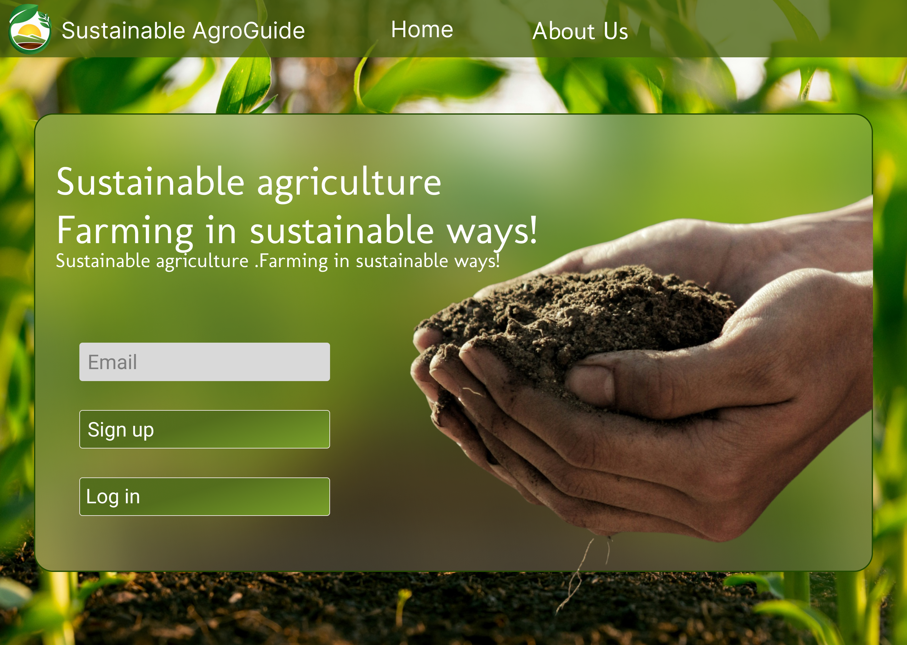
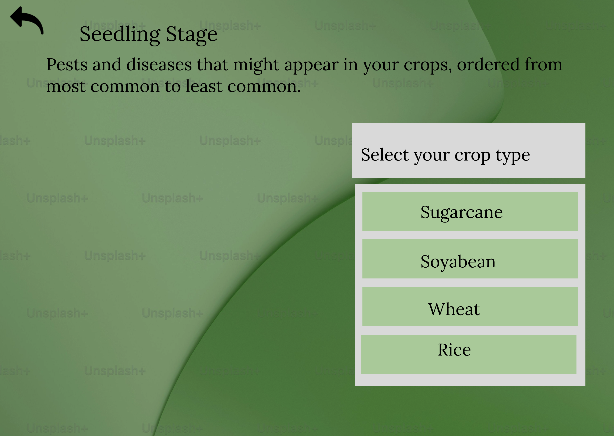
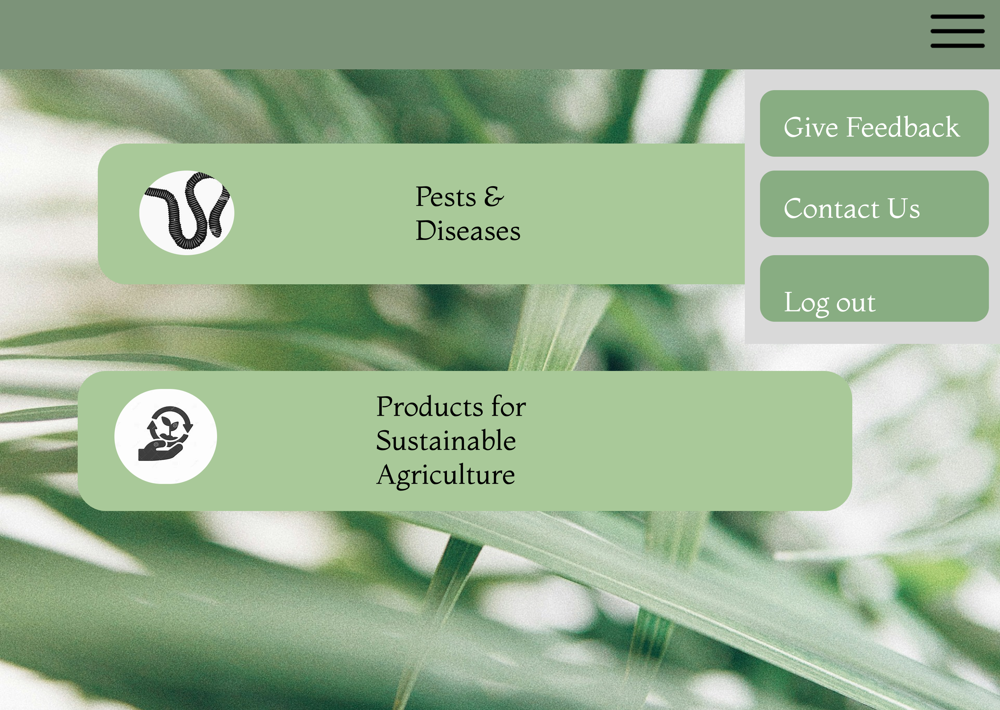
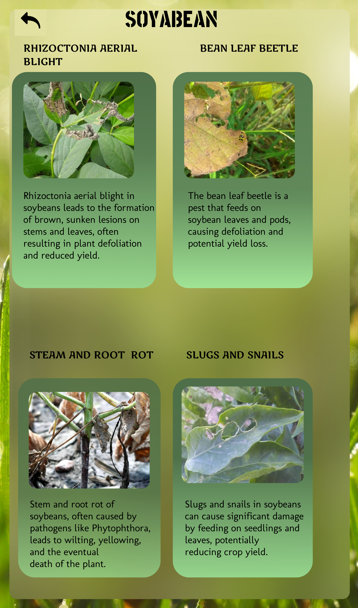
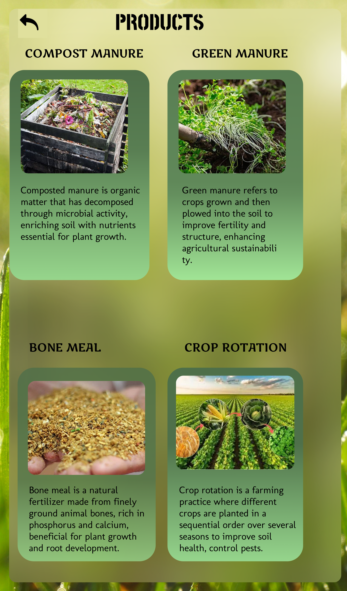

# Sustainable AgroGuide 🌱

A UI/UX prototype designed to promote sustainable agriculture practices and crop disease awareness.

## 📌 Problem Statement
Many farmers lack accessible digital platforms for crop disease identification and sustainable farming guidance.

## 🎯 Solution
Sustainable AgroGuide provides:
- Secure login & user access flow
- Crop selection interface
- Crop-specific pest and disease information
- Sustainable product recommendations

## 🛠️ Tools Used
- Figma (UI/UX Design)

## 📷 Screenshots

### Login Page

### Crop Selection

### Dashboard

### Crop Details

### Products Page

## 🔗 Figma Prototype
https://www.figma.com/design/qf0NkCtOpXytsH22JGsPC3/aec?node-id=0-1&t=R3A5ZWB7yt33IOVg-1

## 🚀 Future Improvements
- Convert prototype into a full-stack web application
- Add backend for farmer data tracking

- Implement real-time pest alert system
